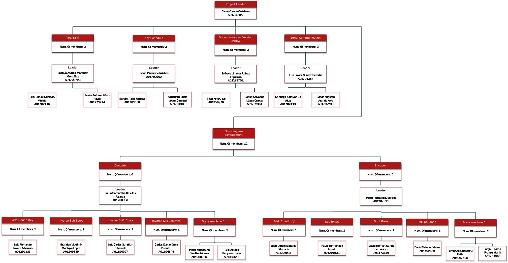
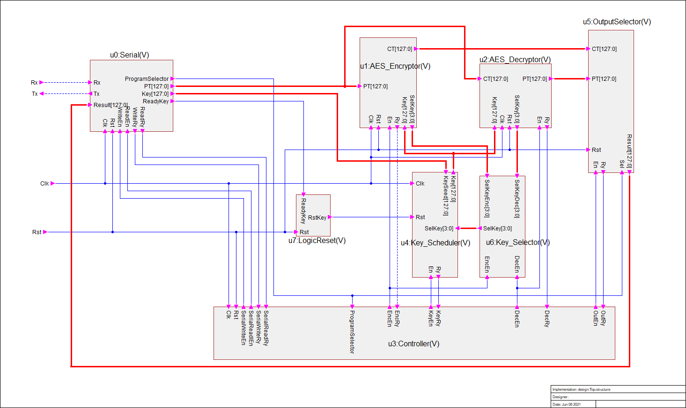
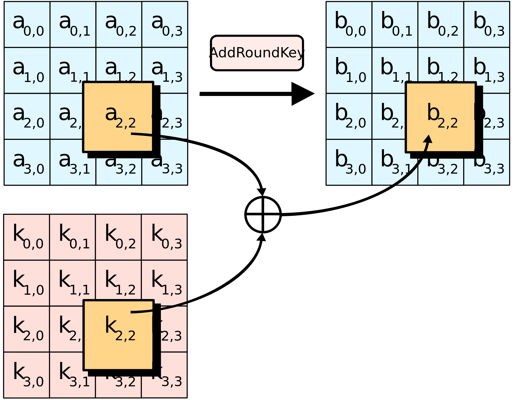
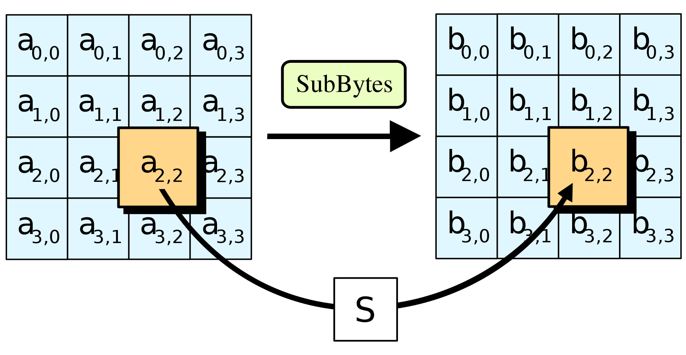
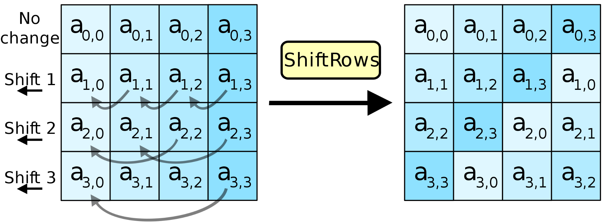
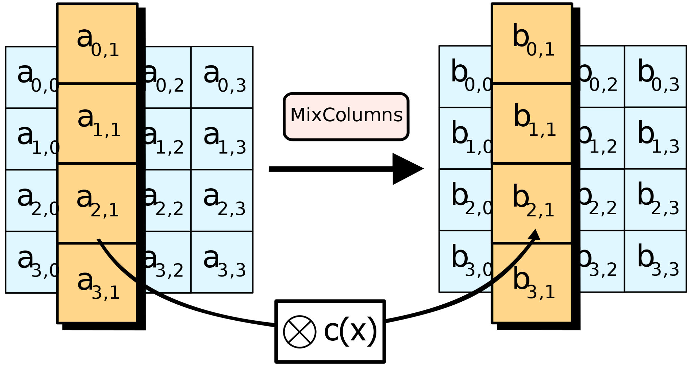
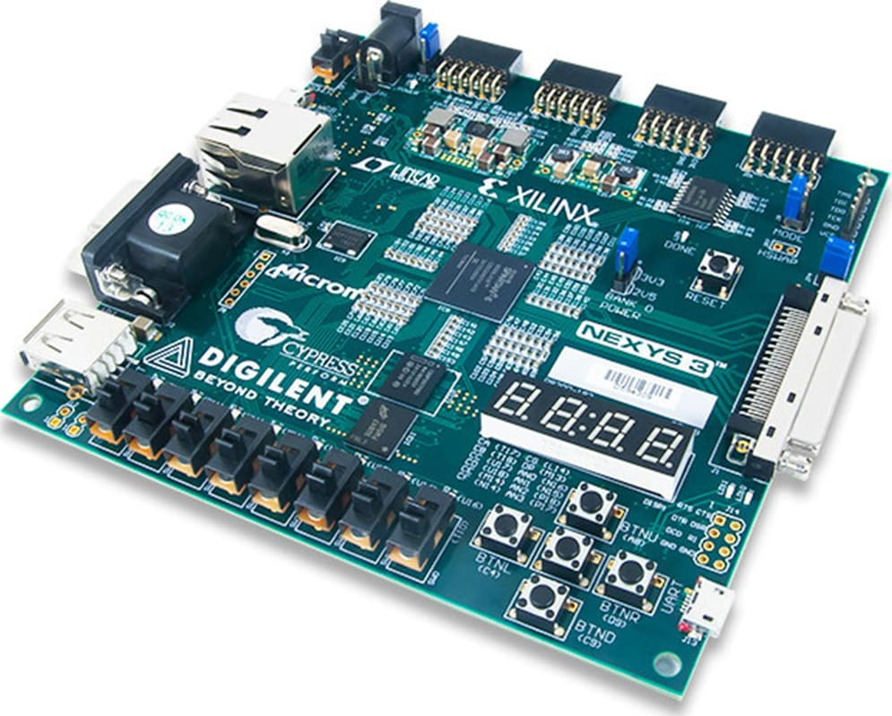
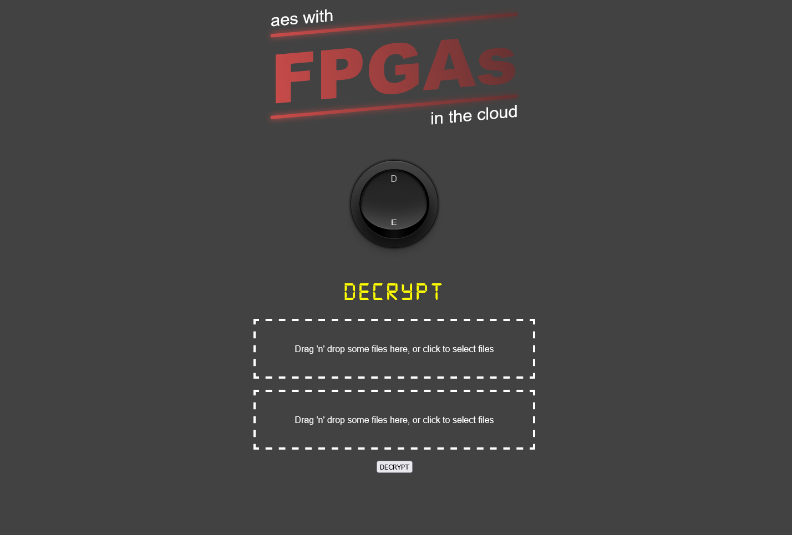

# **Yantio'**
# **A Project of Embedded System Solution**

**Description**

Today, we are highly dependent on technology, which is why we need our information to be transmitted securely, as our high-value data is in danger of falling into the wrong hands and our information can be used incorrectly and without our consent. affecting our personal integrity. With this goal in mind, we developed our pioneering project: Yantio’.

Yantio' is the first project developed by the company Embedded System Solution, it consists of an encryption and decryption machine using the Advanced Encryption Standard (AES) known as Rinjdael, following a 128-bit length key protocol with 10 rounds of encryption.. This project must be implemented in a DIGILENT family FPGA.

For now, the development of this project is only available for use in an FPGA Nexys 3. However, we hope in the future to continue with the project so that it can be implemented in other FPGAs in the family, such as Basis 2 or Basis 3.
## **Objective**
The goal of the program is to protect user information by creating a more secure transmission for your data, and to demonstrate that it can be deployed in more complex modules by using FPGAs. This approach was chosen, since the use of this tool in communication is very high today, thanks to its speed and low costs.
## **Organization**

**Image1. Project Organization Chart** 
## **Schematic of the project**
Here can be seen the Top module of the project, next can be seen the description of each module ordered by ID.

**Image2. Schematic of the project (Top)**

|**ID**|**Name**|**Type**|**Description**|
| :- | :- | :- | :- |
|**u0**|Serial|Verilog|This module controls the serial communication between the FPGA and the user's PC, according to these communications results, the system will encode or decode the data.|
|**u8**|AES128|Verilog|This module controls the logic in the processes according to what it receives from u0 module and returns the result of Encrypting/Decrypting the data to u0|

**Image3. Schematic of the project (Sub-Top)**

The schematic was organized as state machines to achieve greater control and monitoring of the operation of the program and the changes that may arise in it.

|**ID**|**Name**|**Type**|**Description**|
| :- | :- | :- | :- |
|**u0**|Serial|Verilog|This module controls the serial communication between the FPGA and the user's PC, according to these communications results, the system will encode or decode the data.|
|**u1**|AES\_Encryptor|Verilog|This module implements the solution for the encryption according to the Advanced Encryption Standard|
|**u2**|AES\_Decryptor|Verilog|This module implements the solution for the decryption according to the Advanced Encryption Standard|
|**u3**|Controller|Verilog|Responsible for coordinating the beginning and end of the operation of the main modules of the TOP. Indicates when the serial message is received and when the serial message is transmitted through it. It ensures that the encoder or decoder starts working at the right time and that the output is obtained until the end of the previous algorithms.|
|**u4**|Key\_Scheduler|Verilog|It receives the key for the encryption or decryption process and performs the expansion in 10 rounds. Return the key section that is requested.|
|**u5**|Key\_Selector|Verilog|Defines which key to ask the Key Scheduler|
|**u6**|OutputSelector|Verilog|Responsible of giving the output of the encrypted text or decryption according to what the user selected|
|**u7**|LogicReset|Verilog|Resets the Key Scheduler when it receives a key|
Encriptado
## **Specifications**
For the Serial Communication Protocol, the system implements UART with the following structure: 

- 8 bits
- 1 start bit
- 1 stop bit
- 9600 baud rate

For the part of the FPGA, the system will send an ASCII Character “R” to indicate that it is ready to receive data.

For the part of the PC, it will send the following data:

|**ASCII**|**Name**|**Description**|
| :- | :- | :- |
|A|Readkey|` `The next 16 bytes after this correspond to the key|
|B|Readtext|The next 16 bytes after this correspond to the text|
|C|Set Encryption Mode|Changes to  Encryption Mode|
|D|Set Decryption mode|Changes to  Decryption Mode|

For the part of the main implementation, the following information describes the AES basics for allowing user to understand the way of working of the system.

The pseudocode of an AES system is described below:

- Key Expansion using Rijndael Key Scheme.
- Initial Stage:
  - AddRoundKey		
- Rounds:
  - SubBytes
  - ShiftRows
  - MixColumns
  - AddRoundKey
- Final Stage:
  - SubBytes
  - ShiftRows
  - AddRoundKey

|**Step**|**Description**|**Scheme**|
| :- | :- | :- |
|AddRoundKey|Each byte of the state is combined with the round key; each round key derives from the cypher key using an iteration of the key.||
|SubBytes|Non linear substitution where each byte is replaced with another according to a search table.||
|ShiftRows|Transposition where each row of the state is rotated cyclically a determined number of times.||
|MixColumns|mixup operation that operates in the columns of state, combining four  bytes on each column using a linear transformation.||

In the end, it is expected that blocks of clear text of 128 bits will be obtained and the characters are changed from ASCII to Hexadecimal, where each hexadecimal data will be accommodated in a 4 x 4 array so that it starts from left to right and from top to bottom.
## **Requirements**
The user must have installed the [ISE WebPACK Design Software](https://www.xilinx.com/products/design-tools/ise-design-suite/ise-webpack.html) from Xilink Company.

*Note: Installation instructions and .exe are available on the official Xilink website.*

Also the user must have an FPGA type [Nexys 3 Spartan-6 LX16 FPGA](https://reference.digilentinc.com/programmable-logic/nexys-3/start) as shown below.

**Image3. FPGA Nexys 3 Spartan-6**

The necessary files for running the Single Web Application can be obtained from the following github repository: <https://github.com/PauloHJ/ProyectoFinal_SistemasEmbebidosFJ21.git> 

The user must have installed nodejs and Yarn on a Windows PC to be able to run the full project, for more information refer to the following websites:

- <https://nodejs.org/es/> 
- <https://yarnpkg.com/> 
##
## **Features**
User Interface
The platform uses a Single Web Application developed with React. The UI can be seen below.

**Image4. aes with FPGAs Single Web Application**

The interface allows the user to upload two files: The Key and the data to be Encrypted/Decrypted. And also has a switch to let the user decide what is going to be done with that data. 

a)

b)

**Image5. a) File Input box & b) Encryption/Decryption switch button** 
##
## **License and credits**
The Design Software and the Nexys 3 FPGA board was development by Xilink Company and Digilent Company

The project was developed by the students of the Embedded Systems Class Period February - June 2021 of the Instituto Tecnológico y de Estudios Superiores de Monterrey (ITESM) Campus Queretaro.

The manuals of the board provided are owned by Xilink Company and Digilent Company

The development and creation of this project is exclusively academic, so the use of this is only to disseminate the possible applications of Verilog in a field-programmable gate array (FPGA).

OUR PURPOSE IS NOT FOR PROFIT

In case of making use of this program, please give credit to the developers of the project.

